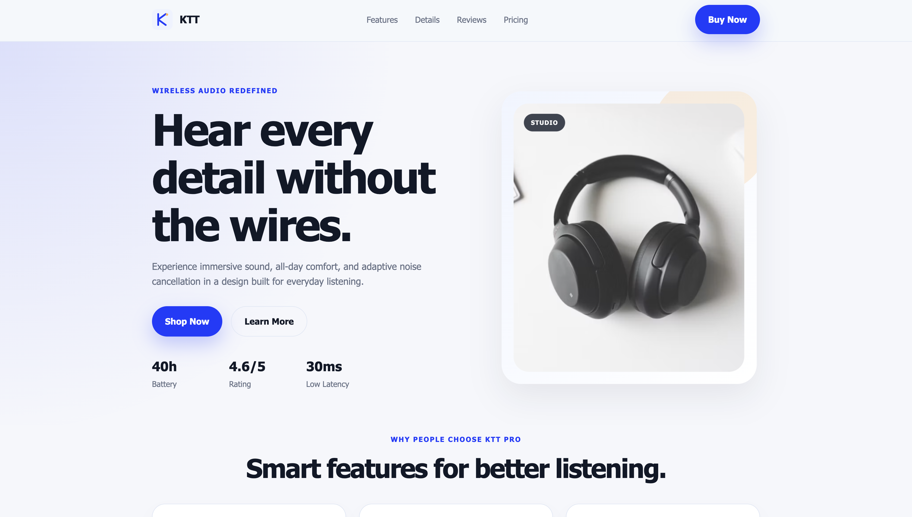

Product Landing Page
A responsive product landing page for a wireless headphones product, built with HTML5 and CSS3.
Features

- Responsive design for desktop and mobile
- Semantic HTML5 structure
- Flexbox and CSS Grid layout
- CSS variables
- Hover and focus effects
- CSS transitions and transforms
- Simple CSS animation
- Product image with object-fit
  Technologies
- HTML5
- CSS3
  Purpose
  This project was created to practice fundamental HTML and CSS concepts, including layout, responsive design, positioning, animations, and modern CSS styling.
  Project Structure
  product-landing-page/
  ├── index.html
  ├── style.css
  ├── README.md
  └── assets/
  Status
  Completed — Mini Project #1

Markdown

## preview

